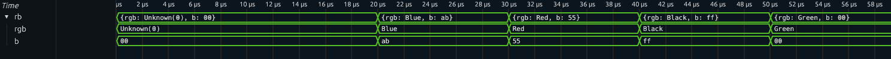

# Bluespec Translation support for surfer waveform viewer.

The process for using this translator is as follows.
## Build wasm
Note: you can download and use the released wasm files.
### For Linux
```
git clone https://gitlab.com/surfer-project/surfer.git 
git clone git@github.com:jahagirdar/bluespec-surfer-plugin.git
cd bluespec-surfer-plugin
make
```
you will need rust and cargo, use your distribution specific methods to load it

### For other OS
Figure out the steps and Please submit a documentation patch

## Setup list_signals.tcl
This requires util/bluetcl-scripts which is in the source but not in the final built code so copy it from the source folder to your install directory

copy list_signals.tcl to a location in your $PATH

# Per Testbench setup
## Bluespec Mapping
The bluespec module instance may not be at the root of your testbench e.g. it might be at tb.dut.foo.instmkBSVTop
for this example write a file called bluespec_map.json with the following content. Adapt as per your hierarchy
```
{
	"top": {"mkTop":["tb", "dut", "foo", "instmkBSVTop"]}
}
```
# When compiling bsv code.
Compiling bsv code generates a bunch of .ba file corresponding to each module
call `list_signals <list of synthesized modules>`
e.g.
```
list_signals.tcl -p bofiles/:+  mkTop mkA
```
this generates bluespec.json

# Viewing waveform with surfer
```
surfer <wavename>.vcd
```
You should now be able to add complex struct and get


